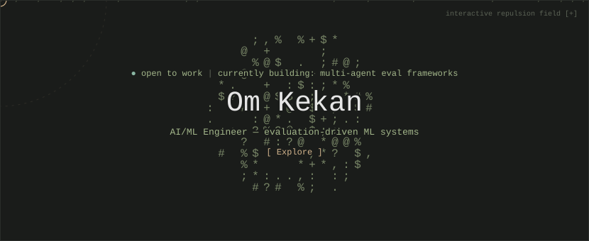
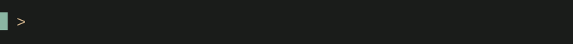
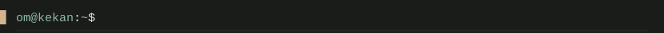

<div align="center">





</div>

```text
om_kekan_studio@root:~$ tree ./system
./system
├── about_me
│   ├── identity.txt..... Om Vijay Kekan
│   ├── location.txt..... India
│   ├── role.sys......... AI/ML Engineer
│   └── focus.sys........ Evaluation-driven ML systems
│
├── capabilities
│   ├── ai_ml_engine.sh.. [EXE]
│   ├── infrastructure.sh [EXE]
│   └── web_stack.sh..... [EXE]
│
└── network_ports
    ├── linkedin.url..... [LINK]
    ├── medium.url....... [LINK]
    ├── youtube.url...... [LINK]
    └── resume.pdf....... [FILE]

3 directories, 11 files
```



<br>



<div align="center">


</div>

<br>


| Project | What it does | Stack |
| :-- | :-- | :-- |
| **[Auto-RAG Agent with Hallucination Guardrails](https://github.com/Omkekan/Auto-RAG-Agent-with-Hallucination-Guardrails)** | A LangGraph state machine that grades retrieved documents for relevance before generating, rewrites the query and re-retrieves when nothing relevant turns up, and checks answers against the retrieved context, regenerating when claims are unsupported. | `LangGraph` `Qdrant` `Ollama` |
| **[RiskReveal Vulnerability Scanner](https://github.com/Omkekan/Riskreveal-Vulnerability-scanner)** | A risk-prioritization engine that correlates 3+ security feeds, de-duplicates overlapping findings, and scores what's left by actual risk, cutting vulnerability noise by roughly 90%. Scans run asynchronously so the UI stays responsive. | `Flask` `Next.js` `Celery` `Redis` |

<br>




<br>


<div align="center">


</div>

<br>


<div align="center">

<a href="https://linkedin.com/in/omkekan"></a>
<a href="https://medium.com/@omkekan27"></a>
<a href="https://www.youtube.com/@the.omvibe"></a>
<a href="mailto:omkekan27@gmail.com"></a>
<a href="https://drive.google.com/file/d/10pxfcXJ2zUWe_RQQYYoXOEcIf4lrAi3s/view?usp=sharing"></a>

</div>

<br>


